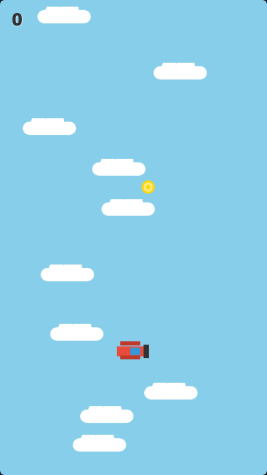

# Sky Hopper (Starbound Aviator)



## 项目概览 (Project Overview)

**Sky Hopper** (在游戏中称为 *Starbound Aviator*) 是一款基于 **Phaser 3** 引擎开发的垂直无限跳跃类街机游戏。玩家控制一架飞机，通过在云朵、卫星和陨石上弹跳来不断向太空攀升。

本项目最初使用原生 JavaScript Canvas API 开发，现已完全重构为 Phaser 3 版本，以利用其强大的物理引擎 (Arcade Physics) 和渲染能力。

## 游戏机制 (Game Mechanics)

### 核心玩法
*   **垂直跳跃**：飞机自动受重力影响下落，触碰平台（云朵/陨石）时会自动弹起。
*   **左右移动**：使用键盘方向键或 A/D 键控制飞机左右移动。
*   **伪无限卷轴**：当飞机飞过屏幕中线时，世界物体会向下滚动，从而模拟飞机的上升过程。

### 生物群落 (Biomes)
游戏世界分为三个垂直层级，随分数增加而变化：

1.  **天空 (Sky)** `0 - 1999 分`
    *   背景：淡蓝色
    *   平台：普通的白云
2.  **平流层 (Stratosphere)** `2000 - 4999 分`
    *   背景：渐变紫色
    *   平台：引入移动平台
3.  **太空 (Space)** `5000+ 分`
    *   背景：深邃星空（带闪烁特效）
    *   平台：陨石和卫星
    *   特性：重力减小 (0.6x)，跳得更高，但控制惯性更大。

### 平台与道具
*   **白云/普通平台**：安全的弹跳点。
*   **灰云/脆弱平台**：踩踏一次后消失。
*   **雷电云/红色陨石**：致命障碍，触碰即游戏结束。
*   **金币**：收集获得 +100 分。
*   **火箭**：获得短暂的强力冲刺（无敌状态）。

## 技术架构 (Technical Architecture)

### 技术栈
*   **引擎**: [Phaser 3 (v3.70.0)](https://phaser.io/)
*   **语言**: Native JavaScript (ES6 Modules)
*   **物理**: Arcade Physics

### 核心系统
1.  **场景管理 (Scenes)**:
    *   `BootScene.js`: 初始化及资源生成。
    *   `PlayScene.js`: 核心游戏循环、状态管理 (Menu, Playing, GameOver)。
2.  **对象池 (Object Pooling)**:
    *   `CloudManager.js`: 管理云朵和道具的生成与回收，避免频繁 GC，保证流畅度。
3.  **程序化生成 (Procedural Generation)**:
    *   **纹理**: `TextureGenerator.js` 使用 Phaser Graphics 实时绘制所有美术资源（飞机、云、金币等），无外部图片依赖，加载极快。
    *   **音频**: `AudioSynth.js` 使用 Web Audio API 生成 8-bit 复古音效。

### 目录结构
```
/
├── index.html          # 游戏入口与 UI 层
├── style.css           # UI 样式
├── js/
│   ├── main.js         # Phaser 配置入口
│   ├── scenes/         # 游戏场景 (Boot, Play)
│   ├── sprites/        # 游戏实体 (Plane, Cloud, Collectible)
│   ├── managers/       # 管理器 (Cloud, Audio)
│   └── TextureGenerator.js # 纹理生成器
└── ...
```

## 快速开始 (Getting Started)

由于使用了 ES6 模块，需要在本地服务器环境下运行，否则会因 CORS 策略报错。

1.  **启动静态服务器**:
    如果你安装了 Python (Mac/Linux/Windows):
    ```bash
    # Python 3
    python -m http.server 8000
    ```
    或者使用 Node.js 的 `http-server`:
    ```bash
    npx http-server .
    ```

2.  **访问游戏**:
    打开浏览器访问 `http://localhost:8000`

## 开发指南

*   **代码规范**: 请参考 [AGENTS.md](./AGENTS.md) 了解详细的编码规范和物理引擎注意事项。
*   **调试**: 可以在浏览器控制台查看游戏状态日志。

## 许可证
MIT License
